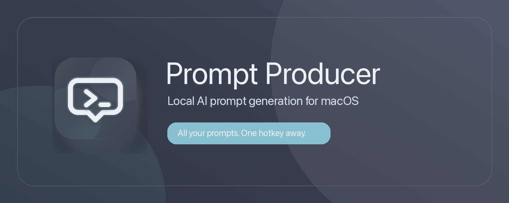

# Prompt Producer



Prompt Producer is a free, local-first macOS prompt library. Save reusable prompts, edit them with a BlockNote-powered editor, search them from a global command bar, and use Apple Foundation Models for local prompt generation where supported.

[Download on the Mac App Store](https://apps.apple.com/app/id6772548801)

## What It Does

- Opens a global command bar with `Command-Shift-U`.
- Creates a new prompt with `Option-Shift-U`.
- Searches saved prompt titles, bodies, and tags with local Fuse.js fuzzy search.
- Previews the selected prompt with `Command-I`.
- Copies a clicked prompt, or uses Return to copy and optionally paste into the last active app.
- Stores prompts locally in Application Support.
- Uses Apple on-device Foundation Models for editor AI features when available.
- Runs without Cloudflare, OpenAI, or any remote prompt-search endpoint.

## Use It Locally For Free

Requirements:

- macOS 14 or newer.
- Xcode Command Line Tools.
- Node.js 22 or newer.
- Apple Foundation Models require a supported macOS version and Apple Intelligence availability.

Clone and run:

```sh
git clone https://github.com/harborline/prompt-pro.git
cd prompt-pro
./script/build_and_run.sh
```

The build script installs the BlockNote web editor dependencies if needed, builds the editor bundle, builds the Swift package, signs a local app bundle when a signing identity is available, and launches Prompt Producer.

Manual development commands:

```sh
npm install
npm run build:blocknote
swift build
swift test
npm run test:web
```

## Usage

1. Launch Prompt Producer.
2. Add or edit prompts in the prompt library.
3. Press `Command-Shift-U` from any app to open the command bar.
4. Type to search by prompt title, body, or tag.
5. Use Up/Down arrows to move through results.
6. Press `Command-I` to preview the selected prompt.
7. Click a result to copy it, or press Return to copy and paste based on your Settings preference.

Accessibility and Automation permissions are only needed if you want Prompt Producer to paste a selected prompt into the app you were already using. Copying works without those permissions.

## App Store Build

The App Store packaging lane expects local signing certificates and App Store Connect credentials configured outside the repository:

```sh
fastlane mac submit_review
```

The repo intentionally does not include local credentials, Sentry auth tokens, build products, node modules, or App Store private state.

## Attribution

[App Icon created by RIkas Dzihab - Flaticon](https://www.flaticon.com/free-icons/command)

## Links

- Support: [help@pdx.software](mailto:help@pdx.software)
- Privacy: [pdx.software/privacy](https://pdx.software/privacy)
- Terms: [pdx.software/terms](https://pdx.software/terms)
- Harborline: [github.com/harborline](https://github.com/harborline)
